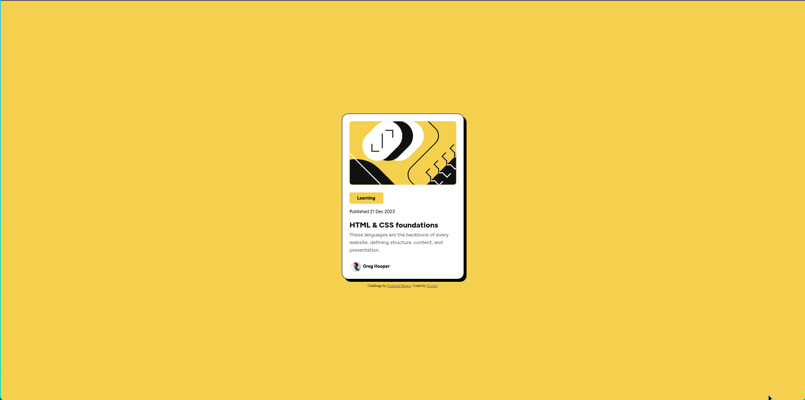

# Frontend Mentor - Blog preview card solution

This is a solution to the [Blog preview card challenge on Frontend Mentor](https://www.frontendmentor.io/challenges/blog-preview-card-ckPaj01IcS). Frontend Mentor challenges help you improve your coding skills by building realistic projects. 

## Table of contents

  - [The challenge](#the-challenge)
  - [Screenshot](#screenshot)
  - [Links](#links)
  - [My process](#my-process)
  - [Built with](#built-with)

### The challenge

Users should be able to:

- See hover and focus states for all interactive elements on the page

### Screenshot

### Links

- Solution URL: [https://github.com/Exc1D/blog-card.git]
- Live Site URL: [https://exc1d.github.io/blog-card/]

## My process
Front-end Mentor already gave me a starter code and a .fig file. I uploaded the .fig file to Pixso.net and used dev mode for getting the style code.

### Built with

- Semantic HTML5 markup
- CSS custom properties
- Flexbox
